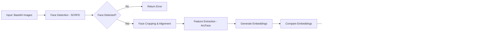

# Aegis Digital ID System - Architecture Documentation

## System Overview

The Aegis Digital ID System is a comprehensive blockchain-based digital identity platform with advanced security features, biometric verification, role-based access control, and democratic voting capabilities.

---

## High-Level System Architecture

---

## Detailed Component Architecture

### 1. Frontend Architecture (React)

**Key Components:**
- **User Dashboard**: Profile, Documents, Blockchain ID, Access Logs, Voting
- **Admin Dashboard**: Security Alerts, Role Management, Emergency Controls, Location Map, Voting Admin
- **Department Dashboard**: User Search, Permission-based Data Access, Document Viewer
- **Registration Flow**: Multi-step KYC, Face Verification, Document Upload, OCR Processing

---

### 2. Backend Architecture (Node.js + Express)

---

### 3. Authentication & Authorization Flow

---

### 4. Face Verification Pipeline

**Technologies:**
- **SCRFD**: State-of-the-art face detection model
- **ArcFace**: Deep face recognition with 512-dimensional embeddings
- **Cosine Similarity**: For face matching (threshold: 0.7)

---

### 5. Voting System Architecture

---

### 6. Department Access Control

**Permission Model:**
- **Immigration Dept**: Passport, Visa, Criminal History, Work Permit
- **Income Tax Dept**: Tax Returns, Payslips, Bank Statements
- **Medical Dept**: Medical History, Insurance Policy, Blood Type

---

### 7. Blockchain Integration

**Features:**
- **Immutable Storage**: Documents stored permanently on IPFS
- **Blockchain Verification**: All transactions recorded on Ethereum
- **Encryption**: AES-256 encryption for sensitive documents
- **Wallet Integration**: Each user has unique blockchain wallet

---

### 8. Emergency Control System

**Capabilities:**
- **System Lockdown**: Immediate user logout and access blocking
- **Data Export**: Emergency backup of all user/admin data
- **System Reports**: Comprehensive security and activity reports
- **Real-time Monitoring**: Live user location and activity tracking

---

### 9. Database Schema Overview

---

### 10. Security Architecture

---

## Technology Stack

### Frontend
- **Framework**: React 18
- **Routing**: React Router v6
- **Styling**: Tailwind CSS
- **Icons**: Lucide React
- **HTTP Client**: Fetch API
- **State Management**: React Hooks (useState, useEffect)

### Backend
- **Runtime**: Node.js
- **Framework**: Express.js
- **Database**: MongoDB with Mongoose ODM
- **Authentication**: JWT (jsonwebtoken)
- **Password Hashing**: bcrypt
- **File Upload**: Multer
- **Security**: Helmet, CORS, Express Rate Limit

### AI/ML Services
- **Face Detection**: SCRFD (Python)
- **Face Recognition**: ArcFace (Python)
- **OCR**: PaddleOCR (Python)
- **Communication**: Child Process / HTTP APIs

### Blockchain
- **Platform**: Ethereum
- **Library**: ethers.js
- **Storage**: IPFS
- **Smart Contracts**: Solidity

### DevOps
- **Process Manager**: Nodemon (Development)
- **Environment**: dotenv
- **Version Control**: Git

---

## Data Flow Diagrams

### User Registration Flow

### Voting Flow

---

## Deployment Architecture

---

## Security Measures

### 1. Authentication
- JWT-based stateless authentication
- Secure password hashing with bcrypt (salt rounds: 10)
- Session management with automatic expiry
- Multi-device session tracking

### 2. Authorization
- Role-based access control (User, Admin, Department)
- Granular permission system for departments
- Resource ownership verification
- Middleware-based access control

### 3. Data Protection
- HTTPS encryption for data in transit
- AES-256 encryption for sensitive documents
- Blockchain verification for immutability
- Regular security audits

### 4. Face Anti-Spoofing
- Liveness detection during verification
- Multiple face angle requirements
- Quality checks on uploaded images
- Similarity threshold enforcement (0.7)

### 5. Emergency Controls
- System-wide lockdown capability
- Immediate session termination
- Audit logging of all actions
- Data export for emergency backup

---

## Performance Optimization

### Frontend
- Component lazy loading
- Image optimization
- Memoization for expensive operations
- Virtual scrolling for large lists
- Debouncing for search inputs

### Backend
- Database indexing on frequently queried fields
- Connection pooling for MongoDB
- Rate limiting to prevent abuse
- Caching strategies for static data
- Efficient query optimization

### AI Services
- Model loading optimization
- Batch processing where applicable
- Result caching for repeated requests
- GPU acceleration when available

---

## Scalability Considerations

### Horizontal Scaling
- Stateless API design for load balancing
- Session storage in distributed cache
- Microservices-ready architecture
- Container-ready deployment

### Vertical Scaling
- Optimized database queries
- Efficient memory management
- Connection pooling
- Resource monitoring

### Data Scaling
- Document storage on IPFS
- Blockchain for immutable records
- Database sharding strategy
- Archive old data periodically

---

## Monitoring & Logging

### Application Monitoring
- Request/response logging
- Error tracking and alerting
- Performance metrics
- User activity tracking

### Security Monitoring
- Failed login attempt tracking
- Unusual access pattern detection
- Real-time security alerts
- Audit trail for sensitive operations

### System Monitoring
- Server health checks
- Database connection monitoring
- AI service availability
- Blockchain network status

---

## Future Enhancements

1. **Mobile Application**: Native iOS/Android apps
2. **Advanced Biometrics**: Fingerprint, iris scanning
3. **Decentralized Identity**: Self-sovereign identity implementation
4. **Multi-language Support**: Internationalization
5. **Advanced Analytics**: ML-based fraud detection
6. **API Gateway**: Centralized API management
7. **Microservices**: Breaking monolith into services
8. **GraphQL**: More efficient data fetching
9. **Real-time Updates**: WebSocket implementation
10. **Enhanced Voting**: Ranked choice, multi-option voting

---

## Conclusion

The Aegis Digital ID System represents a comprehensive, secure, and scalable solution for digital identity management with advanced features including biometric verification, blockchain integration, role-based access control, and democratic voting capabilities. The architecture is designed to be maintainable, secure, and ready for future enhancements.

---

**Version**: 1.0  
**Last Updated**: October 2025  
**Architecture Type**: Layered Monolithic with Service-Oriented Components

